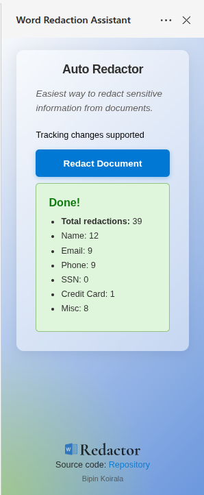
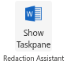

# Word Document Redaction Add-in

A Microsoft Word add-in that automatically detects and redacts sensitive information from documents, adds confidentiality headers, and enables change tracking for audit purposes.

<center>
 &nbsp &nbsp &nbsp
 &nbsp &nbsp &nbsp </center>

## Features

- **Automatic Sensitive Data Detection**: Identifies and redacts various types of sensitive information including:
  - Email addresses
  - Phone numbers
  - Social Security Numbers (SSN)
  - Credit card numbers
  - Names
  - Dates of birth
  - Addresses
  - Medical record numbers
  - Other identifiers

- **Confidentiality Header**: Automatically inserts a "CONFIDENTIAL DOCUMENT" header at the top of the document

- **Change Tracking**: Enables Word's built-in change tracking feature to log all redaction modifications for audit purposes

- **User-Friendly Interface**: Simple task pane with one-click redaction and detailed results summary

## Prerequisites

- Node.js (v14 or higher)
- npm
- Microsoft Word (Desktop or Word on the web)
- SSL certificate (generated automatically on first run)

## Installation

1. Clone the repository:
   
   ```
   git clone https://github.com/b53k/Word-Redaction-Add-In.git
   ```
   ```
   cd Word-Redaction-Add-In
   ```

2. Install dependencies:
   `npm install`

## Running the Project

1. Start the development server:
   `npm start`
      This command will:
   - Generate SSL certificates for local development
   - Start a local HTTPS server on port 3000: `https://localhost:3000`
   - Compile TypeScript files
   - Attempt to automatically sideload the add-in to Word

2. If automatic sideloading fails, you can manually sideload the add-in:
   - Open Word
   - Go to **Add-ins** > **Advanced** > **Upload My Add-in**
   - Select the `manifest.xml` file from the project root

3. Once loaded, start local HTTPS server on port 3000: `https://localhost:3000`. Refresh word, then add-in will appear in the **Home** tab. Click the **Show Taskpane** button to open the redaction interface. 

## Usage

1. Open a Word document containing sensitive information
2. Click the **Show Taskpane** button in the Home tab
3. Review the tracking changes support status
4. Click the **Redact** button to process the document
5. View the redaction summary showing counts of each type of sensitive data found


## Project Structure

```text
├── src/                    # TypeScript source files
│   ├── redaction.ts        # Sensitive data detection logic
│   ├── taskpane.ts         # UI and event handling
│   ├── wordOperations.ts   # Word API operations
│   └── types.ts            # TypeScript type definitions
├── compiledJS/             # Compiled JavaScript output
├── assets/                 # Icons, images and demo
├── scripts/                # Utility scripts
├── index.html              # Task pane HTML
├── styles.css              # Custom styling
├── manifest.xml            # Office Add-in manifest
└── package.json            # Dependencies and scripts
```
